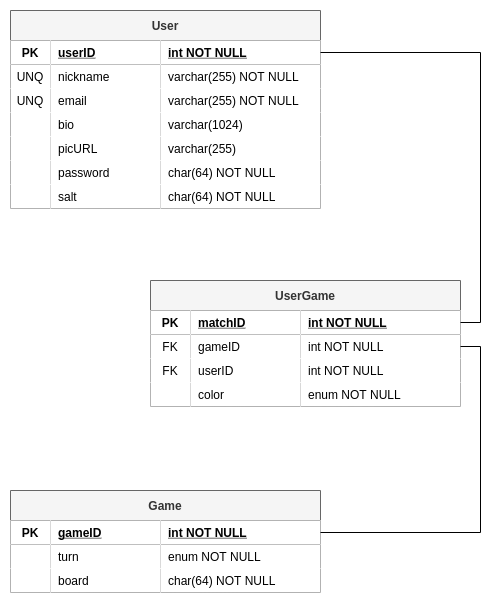

# Database Schema

## DrawIO Link

[DatabaseT02](https://app.diagrams.net/#G1kL6IFYYDkhGAx_803g4YQy30F9WHvUyA)

## Diagram



## Using the Database

### Using mysql on a lab machine

SSH into a lab machine and run this command:
`mysql -u eid -D cs414_team2 -h faure -p`

Then, you can run your SQL commands. Examples:
* SHOW tables;
* DESCRIBE users;
* SELECT * FROM users;

### Running our JDBC code
**RemoteSSH:** Your code is running remotely on the lab machines, which are inside the CSU network and firewall. This does not require port forwarding or additional setup to reach Faure.

**Docker container:** Simply run "connectdb" in a separate VSCode terminal within the container. This does the forwarding.

**Local Linux or Mac:** You must define a shell variable and use port forwarding whenever you run the program.

Shell variable: In your .bashrc or .bash_profile (Mac), add this line:

`export T02_USE_DATABASE_TUNNEL=true`
* Restart the IntelliJ or VSCode terminal and run "echo $T02_USE_DATABASE_TUNNEL" to make sure it equals "true".
* If this is defined, the code will use the link "jdbc:mariadb://127.0.0.1:56247/cs414_team2", which will send DB activity to your local 56247 port, which is then forwarded through a lab machine to Faure:3306 if you set up an SSH tunnel as described below.

You can put something like this into your ".ssh/config" file, and then run "ssh db414" in a separate terminal.
```
Host db414
    Hostname keystone.cs.colostate.edu
    user myeid
    LocalForward 56247 faure:3306
```

Alternatively, you can just run "**ssh -L 56247:faure.cs.colostate.edu:3306 eid@keystone.cs.colostate.edu**" but then you have to remember the command.

You can use any [available CS lab machine](https://www.cs.colostate.edu/machinestats/?column=users&order=asc), Keystone is just an example. 